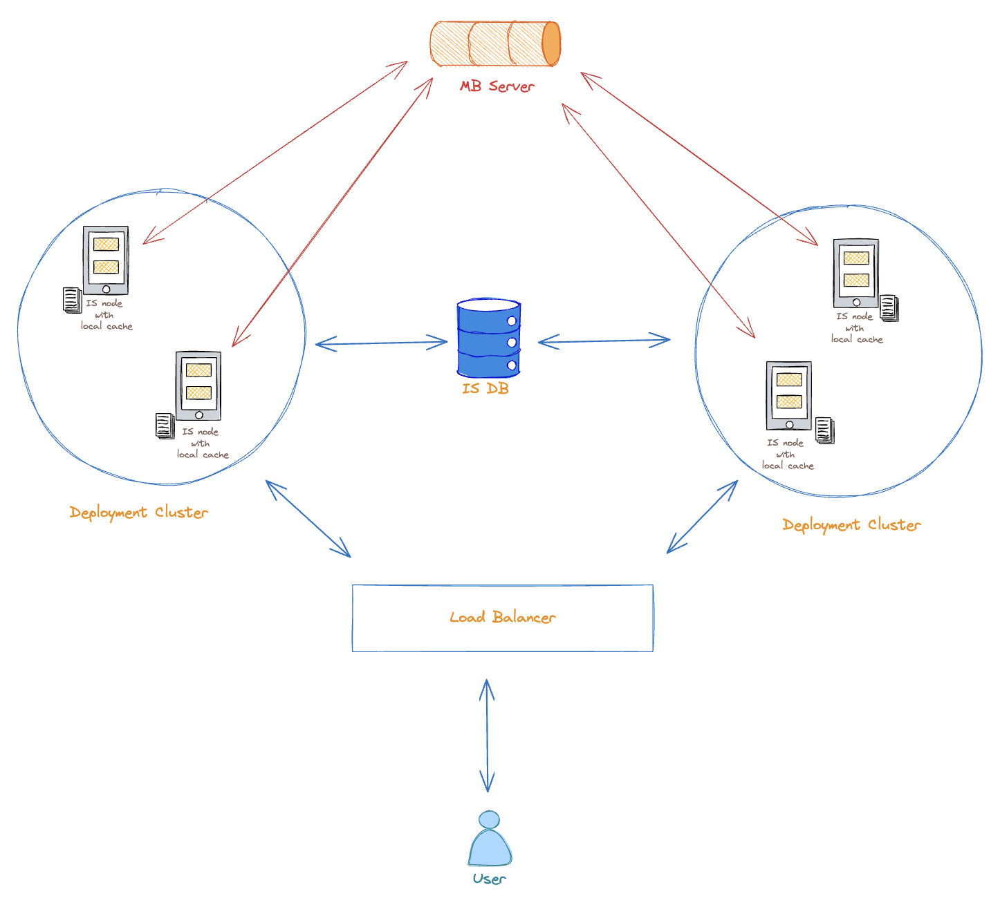

### Introduction
This connector supports cache invalidation message exchange across multi-cluster deployments, which enables the deployment of Identity Server (IS) in Active-Active mode. It establishes connections between IS servers and a designated Central broker (to be deployed independently) through a topic using a publish/subscribe (pub/sub) mechanism.

### Why is it mandatory to use this connector?

Applications are often deployed across multiple centers to ensure high availability and better disaster recovery, aiming to achieve good performance and reliability. However, this multi-center deployment introduces challenges with caching, particularly the cache coherence problem.
Within a single cluster the cache coherence issue is fixed by relying on Hazelcast (to pass cache-invalidation/sync messages). However, Hazelcast cannot be used to transmit sync messages across separate clusters.

For example, let's consider a scenario where two clusters of WSO2 Identity Server (IS) are deployed, Cluster A and Cluster B. If Cluster A issues an access token and subsequently receives a token revocation request, Cluster A may not be aware of this event. Consequently, Cluster A continues to treat the previously issued access token as valid in its cache, even though it has been revoked by Cluster B. This inconsistency in cache states across clusters leads to the cache coherence problem. 

Attempting to deploy IS as multiple Active-Active clusters exacerbates the cache coherence problem. Inconsistent caches between clusters can lead to unexpected behaviors and potential security risks. While disabling all cache layers may seem like a solution, it comes at the cost of significant performance degradation

### Deployment Patterns
There are two viable deployment patterns for handling the cache invalidation message using a Message Broker(MB).

1. MB serves as the central hub, connecting all nodes across different clusters to seamlessly share the invalidation message.
   - Each node can publish/subscribe to cache invalidation message
   - No need configure Hazlecast clustering.
   

2. Hazlecast takes care of invalidation message propagation within a cluster, whereas MB will do the sharing across different clusters
    - Here only one node from each data-center is connected to the MB and passes invalidation message across clusters 
   

### Try Out

#### Common

- Common Setup for IS: [Refer](resources/common-resources/IS_README.md)

#### Connect with ActiveMQ

1. Setup IS for ActiveMQ: [Refer](resources/active-mq-resources/ACTIVEMQ_README.md)
2. Deploy ActiveMQ Message Broker:  [Refer](resources/active-mq-resources/ACITVMQ_MB_DEPLOYMENT.md)

#### Connect with RabbitMQ

- Setup IS for RabbitMQ: [Refer](resources/common-resources/RABBITMQ_README.md)

#### Connect with IBM MQ

1. Setup IS for IBM MQ: [Refer](resources/ibm-mq-resources/IBMMQ_README.md)
2. Deploy IBM MQ Message Broker: [Refer](resources/ibm-mq-resources/IBMMQ_MB_DEPLOYMENT.md)

### Performance Improvement

We can improve the performance of Message Brokers by reducing the cache invalidation messages that needs to be send across. Ideally we don't need sync clusters for all the cache. Refer [Performance Improvement](resources/common-resources/PERFORMANCE_IMPROVEMENT.md) for more details.
