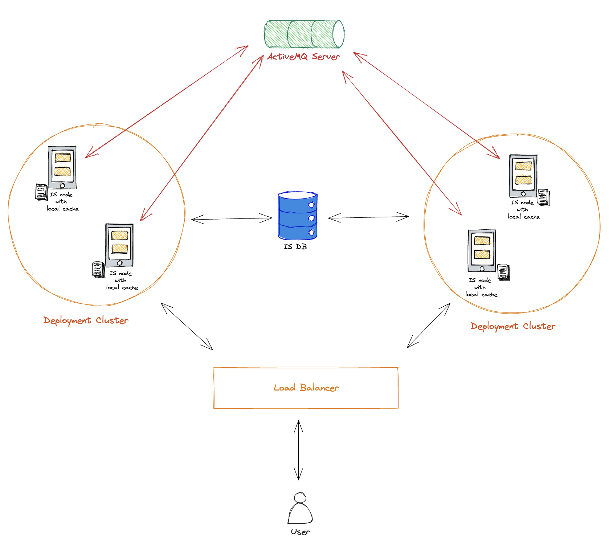
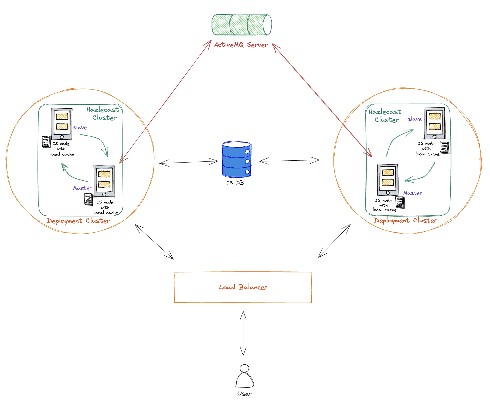

### Introduction
This connector supports cache invalidation message exchange across multi-cluster deployments, which enables the deployment of Identity Server (IS) in Active-Active mode. It establishes connections between IS servers and a designated Central broker (to be deployed independently) through a topic using a publish/subscribe (pub/sub) mechanism.

### Deployment Patterns
There are two viable deployment patterns for handling the cache invalidation message using a Message Broker(MB).

1. MB serves as the central hub, connecting all nodes across different clusters to seamlessly share the invalidation message.
   - Each node can publish/subscribe to cache invalidation message
   - No need configure Hazlecast clustering.
   

2. Hazlecast takes care of invalidation message propagation within a cluster, whereas MB will do the sharing across different clusters
    - Here only one node from each data-center is connected to the MB and passes invalidation message across clusters 
   

### Try Out

#### Common

- Common Setup for IS: [Refer](IS_README.md)

#### Connect with ActiveMQ

1. Setup IS for ActiveMQ: [Refer](ACTIVEMQ_README.md)
2. Deploy ActiveMQ Message Broker:  [Refer](ACITVMQ_MB_DEPLOYMENT.md)

#### Connect with RabbitMQ

- Setup IS for RabbitMQ: [Refer](RABBITMQ_README.md)

#### Connect with IBM MQ

- Setup IS for IBM MQ: [Refer](IBMMQ_README.md)